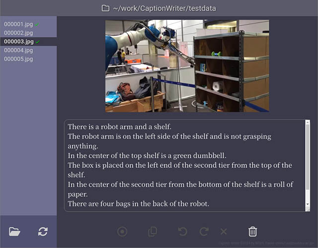

# Caption Writer
NISHI, Takao <nishi.t.es@osaka-u.ac.jp>

## What's this?
"Caption Writer" is a tool to easily create captioned image datasets for training VL models.



It's a GUI tool, but almost all operations can be done using just the keyboard.

## Installation
### Dependency
* [Node.js](https://nodejs.org/) (>=20.0.0)
  * [Electron](https://www.electronjs.org/)
  * [file-type](https://www.npmjs.com/package/file-type) (<=16.5.4)
  * [image-size](https://www.npmjs.com/package/image-size)
  * [windows-drive-letters](https://www.npmjs.com/package/windows-drive-letters)
  * [roboto-fontface](https://www.npmjs.com/package/roboto-fontface)
  * [FontAwesome 6 Free](https://www.npmjs.com/package/@fortawesome/fontawesome-free)

1. install node.js and npm
2. run `npm install` to install the remaining dependent libraries (electron, fontawesome-free, roboto-fontface, file-type, image-size and windows-drive-letters)

```
$ cd Path/where/CaptionWriter/downloaded
$ npm install
```

## Running
```
$ cd Path/where/CaptionWriter/downloaded
$ ./node_modules/.bin/electron .
```

### Caption files
Your caption will be saved in the same folder as the original image with the file name changed to '.caption' with the extension of the original image.
For example, the caption for `/some/where/image.jpg` will be saved as `/some/where/image.caption`.

The `*.caption` file is a UTF-8 plain text file.

### Command-line options

```
--config-file file, -c file :full path of the config file (~/.capw)
--config-dir dir, -C dir    :config files directory (~)
--data-dir dir, -d dir      :data files directory (.)
--ignore-last-status        :ignore the last status file on start up
```

### Key bindings

See [keybindings.md](keybindings.md)

## License

BSD 2-Clause "Simplified" License

See [LICENSE](./LICENSE) for details.
